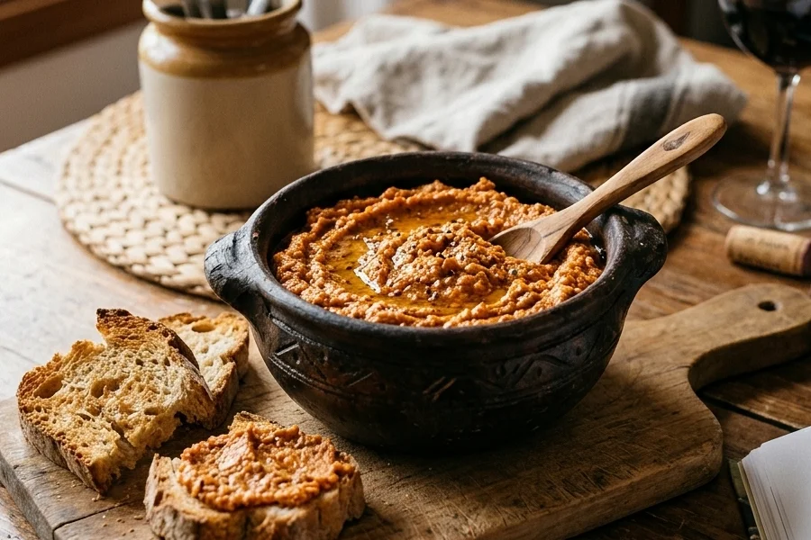

# Almogrote gomero

## Ingredientes

- 500 g de queso duro
- 500 g de tomate maduro triturado
- 5 dientes de ajo
- 1 pimienta picante
- Aceite
- Sal

## Preparación

Pelar los ajos y limpiar la pimienta. Majarlos en un mortero con la sal.

Agregar el majado a los tomates triturados y reservar.

Rallar el queso e incorporar un chorrito junto con la mezcla de tomate tritura y majado.

Remover hasta conseguir una pasta bien ligada.
