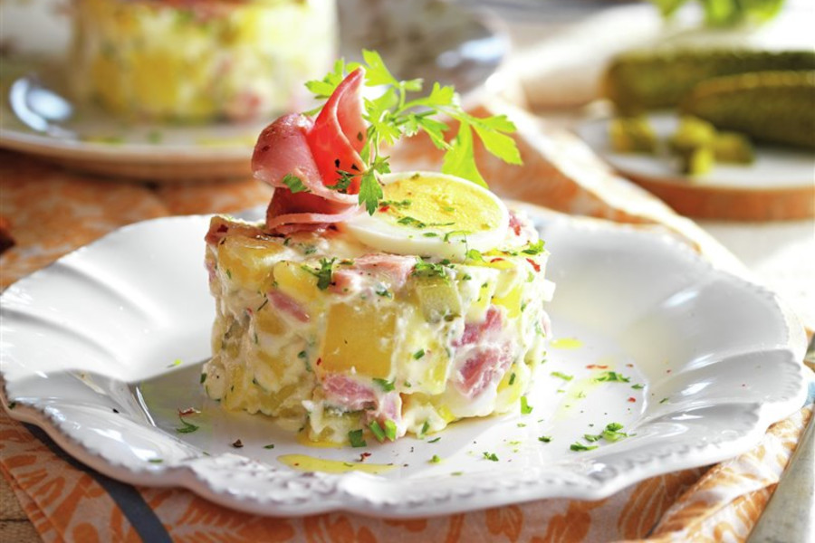

# Ensaladilla De Papas Con Lacon Y Huevo

## Ingredientes

- 4 papas grandes
- 200 gr de lacón o salchichas frankfurt
- 150 gr de atún
- 3 huevos cocidos
- 3 pepinillos grandes
- 100 ml de mayonesa
- 60 ml de yogur griego
- Aceite de oliva
- Perejil
- Sal y pimienta

## Preparación

Pela las papas y córtalas en dados pequeños de 1 cm. Lávalas y cuécelas 10 minutos en agua salada. Escúrrelas y reserva.

En un bol grande añade el lacón cortado en dados, el atún bien escurrido, los pepinillos en rodajas, los huevos duros picados, una ramita de perejil picada, la mayonesa mezclada con el yogur griego y las papas cocidas.

Revuelve la mezcla, salpimenta a gusto y deja refrescar la ensaladilla un par de horas en la nevera.

Puedes emplatar la ensaladilla moldeándola en un aro de cocina y decorarla con una rodaja de huevo duro, lacón y unas hojas de perejil.
