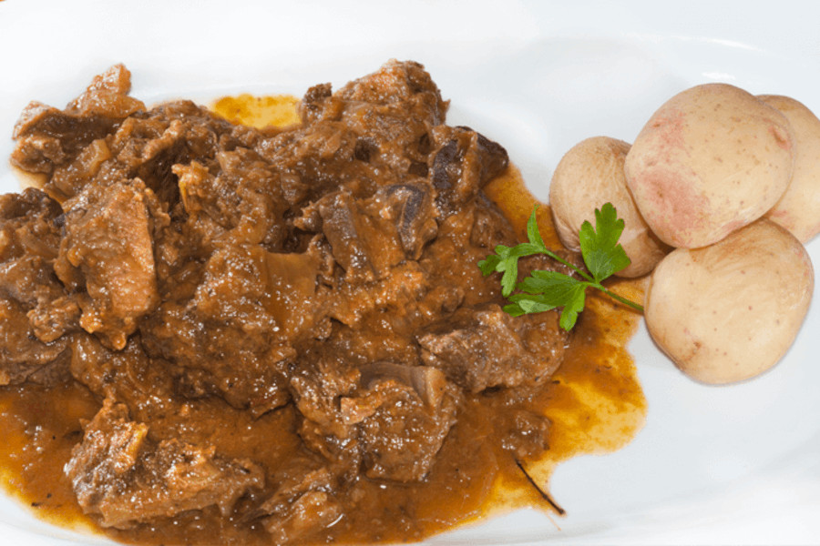

# Cabra Guisada

## Ingredientes

- 1 kg de carne de cabra
- 2 cebollas
- 3 dientes de ajo
- 2 limones
- 200 ml de vino tinto
- Almendras tostadas y pasas
- Orégano, comino y laurel
- Aceite, sal y pimienta

## Preparación

Guisar la carne de cabra con un limón y media cebolla. Al romper a hervir, sacar la carne y lavarla.

Aderezar la carne con zumo de limón y salpimentarla.

Saltear la carne en un caldero junto con la verdura para sofreírla.

Majar las especias junto a las almendras tostadas y añadirlas al caldero.

Añadir el vino al caldero y dejar que evapore el alcohol.

Cubrir el cocido con agua y guisar durante una hora y media.
