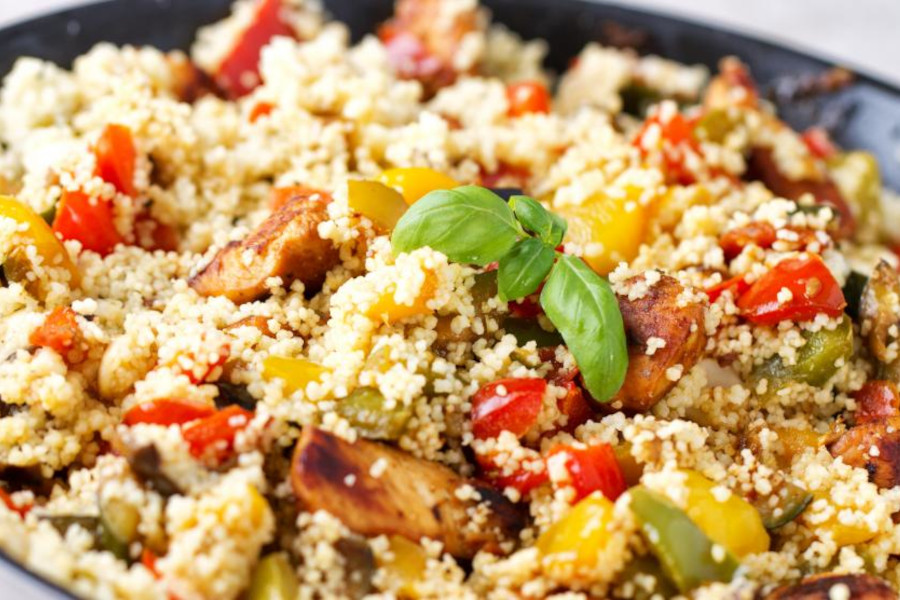

# Cuscus De Pollo Y Verduras

## Ingredientes

- 200 g cuscús
- 3 pechugas de pollo
- 1 zanahoria
- 1 calabacín
- 1 pimiento rojo
- 1 pimiento verde
- 2 dientes de ajo
- 2 cebollas
- Caldo de verduras
- Aceite
- Curry, sal, pimienta, avecrem

## Preparación

Picar la pechuga en tiras y sellarlas en una sartén caliente con aceite. Apartar las pechugas medio hechas y reservar.

En la misma sartén pochar la cebolla, la zanahoria, el ajo, los pimientos y el calabacín.

A continuación agregamos el pollo y las especias al gusto (sobres de fajitas, curry, avecrem, etc.),
dejar unos minutos y reservar.

Preparar taza y media de cous cous y dos tazas de caldo de verduras.
Calentar el caldo y echarlo al cous cous.

Mezclar el cous cous listo con la verdura y el pollo preparados en su jugo.

Dejar reposar unos minutos y servir.
