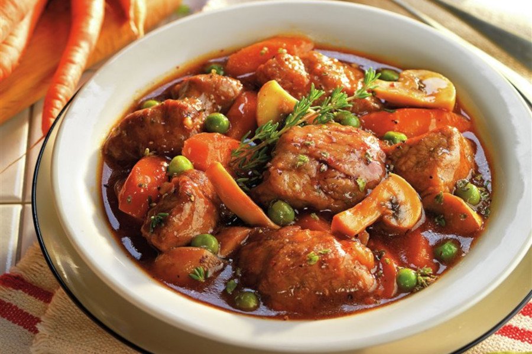

# Estofado De Ternera

## Ingredientes

- 800 gr de ternera cortada en tacos
- 1 cebolla
- 2 ajos
- 200 gr de champiñones
- 3 zanahorias
- 200 ml de tomate triturado (1 tomate)
- 200 ml de cerveza
- 800 ml de caldo de carne
- 100 gr de harina de trigo
- 200 gr de guisantes
- 2 ramitas de perejil
- Tomillo
- Aceite de oliva
- Sal y pimienta

## Preparación

Salpimenta la carne y rebózalas en harina para dorarla en una cazuela con aceite.

Añade la cebolla y rehoga unos minutos hasta que transparente.

Continúa con la zanahoria picada, los champiñones limpios y el tomillo y sigue rehogando unos minutos.

Añade el tomate triturado y la cerveza y calienta para reducir la cerveza.

Incorpora el caldo de carne y deja guisar unos 45 minutos a fuego medio.

Añade los guisantes y deja cocinar unos 15 minutos más.

Termina probando el punto de sal y salpimenta a gusto antes. Deja reposar el cocido antes de servir.
