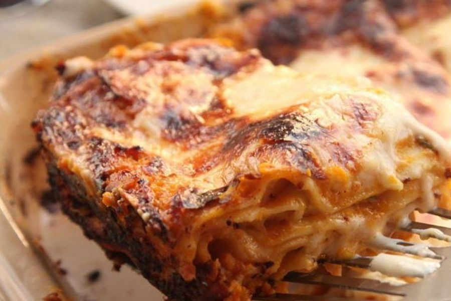

# Pastel De Calabaza Y Pollo

## Ingredientes

- Una docena de placas de pasta para lasaña
- 700 gr de calabaza
- 1 kg de pechuga de pollo
- 200 ml de caldo de ave
- 2 cebollas
- 2 dientes de ajo
- 500 gr de queso ricota
- 100 gr de queso rallado
- 2 cucharadas de mantequilla
- Unas hojas de salvia (o mezcla de romero y tomillo)
- Sal y pimienta

## Preparación

Salpimentar la pechuga y sellarla en una sartén caliente con un chorro de aceite, luego cortarla en dados y reservar.

Pelar y picar las cebollas, los ajos y la calabaza.

Preparar el relleno del pastel en un wok:

1. Empezar salteando la cebolla 5 minutos.
1. Añadir el ajo y sigue salteando otros minutos más.
1. Añadir la calabaza junto al caldo y las especias y dejar cocer unos diez minutos o hasta que el agua se evapore.
1. Agregar el pollo junto al queso ricota desmenuzado, cocer unos minutos y retirar.

Mientras el relleno reposa, cocer las placas de pasta el tiempo indicado por el fabricante.

En una fuente refractaria, engrasada con mantequilla, intercalar las placas de pasta con capas de relleno. Finaliza con el queso rallado espolvoreado.

Precalentar el horno a 180 ºC, añadir la fuente con el pastel y dejar hornear de 20 a 25 minutos.

Servir el plato decorado con unas hojas de salvia.
