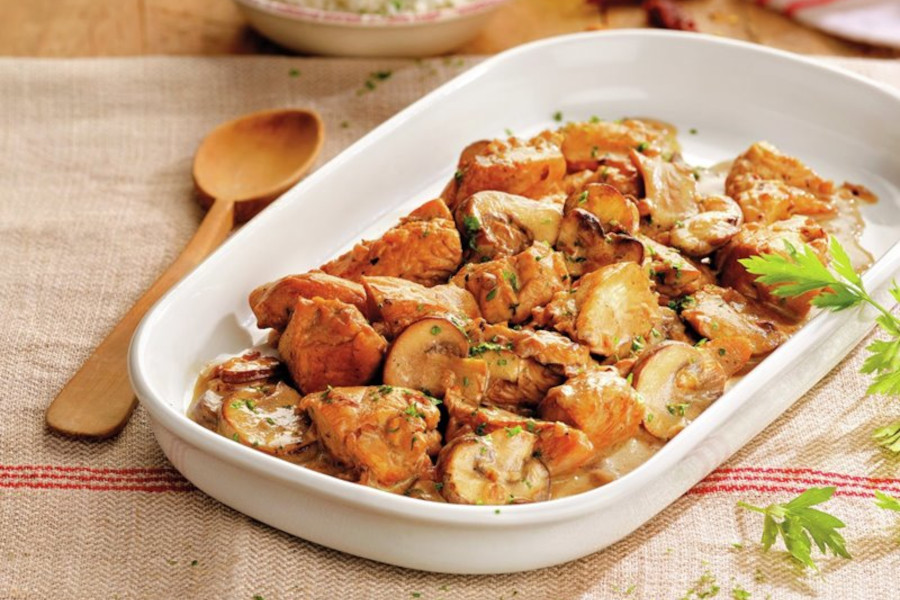

# Pechuga Cocida Con Champinones

## Ingredientes

- 4 pechugas de pollo
- 250 gr de champiñones
- 150 ml de caldo de pollo
- 300 gr de crema agria o nata
- 1 cebolla
- 50 gr de mantequilla
- 200 gr de arroz
- Aceite de oliva
- Perejil
- Sal y pimienta

## Preparación

Pica el pollo en tacos de tamaño bocado, salpiméntallos y séllalos a fuego fuerte en una cazuela con aceite de oliva. Retira el pollo de la cazuela y reserva.

En la misma cazuela, con el resto del aceite y la mantequilla pocha la cebolla hasta que transparente.

Agrega los champiñones limpios y cortados en láminas y cocina hasta que suelten el agua y estén dorados.

Añade el pollo, la crema agria y el caldo. Remueve, tapa la cazuela y deja cocinar 30 minutos a fuego medio.

Mientras el cocido se va haciendo, prepara el arroz de acompañamiento siguiendo las indicaciones del fabricante.

Espolvorea el arroz cocido con pimienta negra y ajo en polvo y saltéalo en una sartén con un poco de aceite hasta que esté tostado.

Emplata con una ración de arroz y otra de pollo. Decora con un poco de perejil picado.
