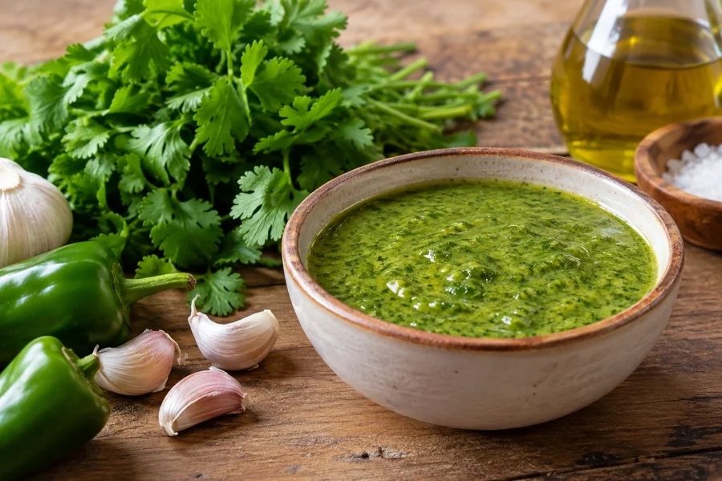

# Mojo de cilantro

## Ingredientes

- 1 manojo de cilantro
- 5 dientes de ajo
- 1/2 pimienta verde o roja
- 1/2 cucharadita de comino
- 100 ml de aceite
- 1 cucharada de vinagre
- 1 cucharadita de sal

## Preparación

Tostar el comino y majarlo en un mortero.

Añadir el ajo, el cilantro, la pimienta y la sal. Seguir majando hasta conseguir una masa uniforme.

Añadir el aceite y el vinagre y revolver hasta que la mezcla emulsione.
