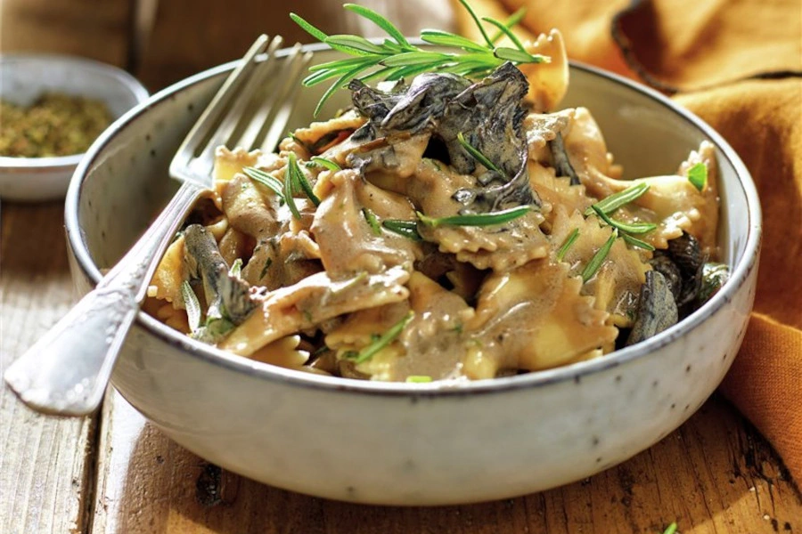

# Pasta con setas a la foie

## Ingredientes

- 350 g de setas
- 320 g de pasta corta
- 200 ml de nata
- 100 g de foie fresco
- 500 ml de caldo de carne
- 1 diente de ajo
- 1 rama de perejil
- 1 rama de romero
- Aceite de oliva
- Pimienta y sal

## Preparación

Limpia las setas, lávalas rápidamente y sécalas con papel de cocina.

Cuece las setas en una sartén honda hasta que suelten todo el agua. Vierte un poco de aceite y sofríe las setas con el ajo picado unos cinco minutos.

Añade la nata y cuece hasta que espese. Mezcla el foie con la nata hasta incorporar, vierte el caldo de carne y lleva a ebullición. Cuece durante cinco minutos más a fuego fuerte hasta que reduzca el caldo. Prueba la salsa y rectifica con sal y pimienta.

En una cazuela aparte cuece las pasta al dente, escúrrela, añade la salsa y remuévela hasta que esté bien impregnada.

Servir la pasta y decórala con el romero y el perejil picado fino.
