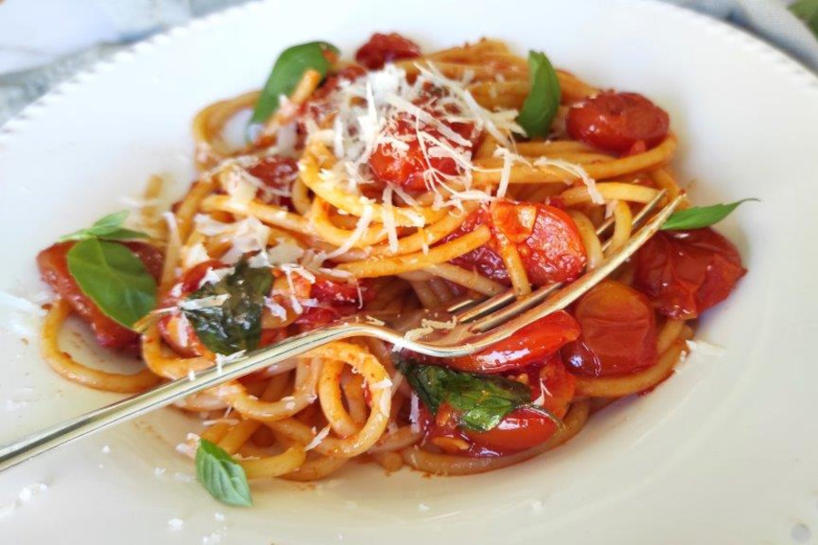

# Pasta Con Cherrys

## Ingredientes

- 300 gr de pasta
- 600 gr de pechuga de pollo
- 800 ml de tomate triturado
- 100 ml de nata
- 12 tomates cherry
- 100 gr de queso rallado
- 1 cucharadita de pimentón
- 1 diente de ajo
- Albahaca
- Aceite de oliva
- Sal y pimienta

## Preparación

Empieza mechando la pechuga. Colócala en un caldero con agua, llévalo a ebullición y déjalo reposar. Saca la pechuga y desmenúzalas en hilos con dos tenedores.

En un wok con un poco de aceite dora el ajo picado, agrega el tomate triturado y cuece hasta que evapore el agua. Vierte la nata y adereza con sal y pimienta. Cuece 2 minutos más y añade el pollo mechado.

Cuece la pasta al dente según el tiempo indicado por el fabricante, escúrrela, añádela a la salsa preparada y remueve.

Sirve el plato de pasta decorado con queso rallado, albahaca y con varios tomates cherry salteados en sartén.
