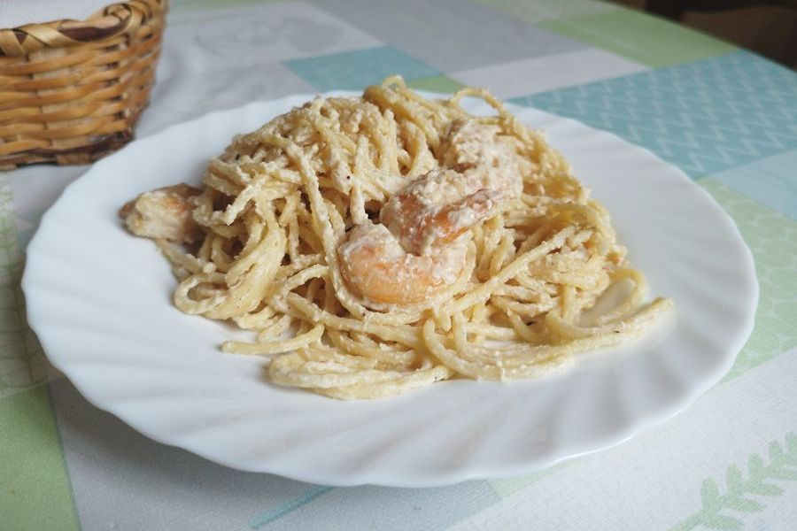

# Pasta Con Langostinos

## Ingredientes

- 300 gr de pasta
- 20 langostinos
- 300 ml de nata
- 80 gr de queso rallado
- 3 diente de ajo
- Aceite de oliva
- Sal y pimienta

## Preparación

Pela los langostinos y pela y pica los ajos.

En un wok, dora los langostinos con un poco de aceite y reserva.

En el mismo aceite dora un poco los ajos, añade la nata y el queso rallado y deja cocinándose la salsa a fuego suave.

En una cazuela cocina la pasta al dente según las indicaciones del fabricante, reserva un vaso de caldo de cocción y escurre la pasta.

Añade la pasta y los langostinos a la salsa y remueve hasta integrar, añade un poco de caldo de la cocción de la pasta si quedó demasiado espesa, salpimenta y sirve.
