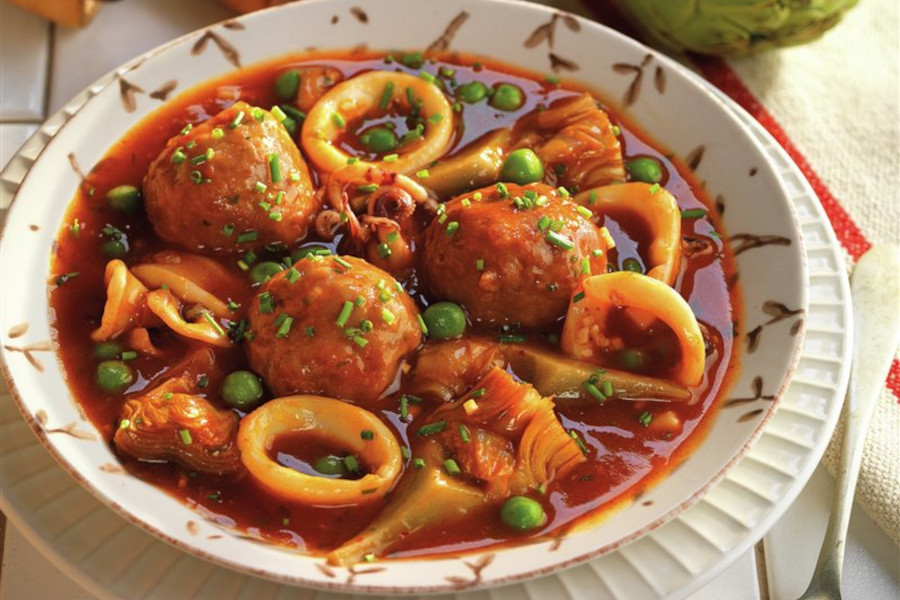

# Guiso De Calamares Con Alcachofas Y Albondigas

## Ingredientes

- 400 gr de calamares
- 4 alcachofas
- 1 cebolla
- 100 gr de pan duro
- 50 ml de leche
- 100 ml de tomate frito.
- 400 ml de caldo de carne
- 150 gr de guisantes
- Aceite de oliva
- 1 ñora
- Sal y pimienta

Para las albóndigas:

- 400 gr de carne picada
- 1 huevo
- 2 ramitas de perejil
- Harina de trigo
- Aceite de oliva
- Ajo molido
- Sal y pimienta

## Preparación

Prepara las albóndigos remojango el pan en la leche y mézclalo con la carne picada, añade 1 huevo, un chorro de aceite, ajo molido y perejil picado, sal y pimienta. Forma pequeñas albóndigas con las manos humedecidas y enharinadas. Reserva.

> También puedes hacer esta receta con albóndigas de pollo o pescado.

Limpia los calamares retirando la boca y las tripas y lávalos bien. Córtalos en rodajas y reserva.

Pela las alcachofas y córtalas en cuartos retirando el heno. Reserva.

En una cazuela con aceite dora las albóndigas con los calamares y las alcachofas. Añade la ñora y el tomate frito y cuece unos minutos para reducir el agua. Añade el caldo de carne caliente junto a los guisantes, salpimenta y deja guisar a fuego medio unos 25 minutos. 

Deja reposar antes de servir.
