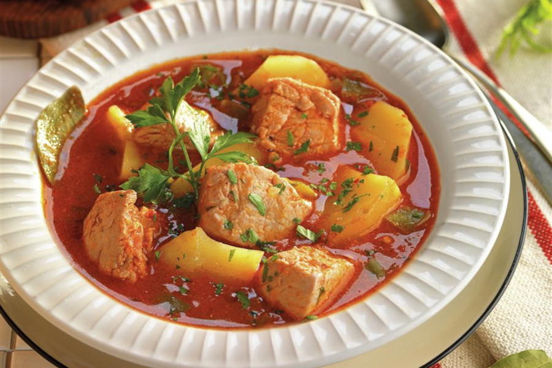

# Marmitako De Atun

## Ingredientes

- 400 gr de lomo de atún o bonito
- 1 cebolla
- 1 tomate
- 1 pimiento verde
- 4 papas
- 200 ml de vino blanco
- 800 ml de caldo de pescado
- 2 ajos
- 1 ñora
- 1 guindilla
- 1 cucharadita de pimentón dulce
- 2 hojas de laurel
- 1 ramita de perejil
- Aceite de oliva
- Sal y pimienta

## Preparación

Corta el atún en tacos de tamaño bocado y salpiméntalos, pela y pica la cebolla en dados pequeños, lava y pica el pimiento, lava y tritura el tomate, pela las papas y cáscalas, lava y pica el perejil y pela y pica los ajos.

En una cazuela rehoga la cebolla y el pimiento hasta que transparente la cebolla. Añade el ajo, la guindilla, la ñora y el pimentón dulce y el tomate triturado y cuece hasta que reduzca el agua.

Mientras tanto en un cazo deja calentándose el caldo de pescado a fuego bajo.

Incorpora las papas cascadas y el vino blanco y deja que evapore el alcohol. Luego añade el caldo de pescado caliente y el laurel y deja guisar a fuego lento durante 25 minutos hasta que las papas estén tiernas.

Añade los tacos de atún, el perejil picado y salpimenta. Cuece durante 5 minutos más y deja reposar el guiso.
