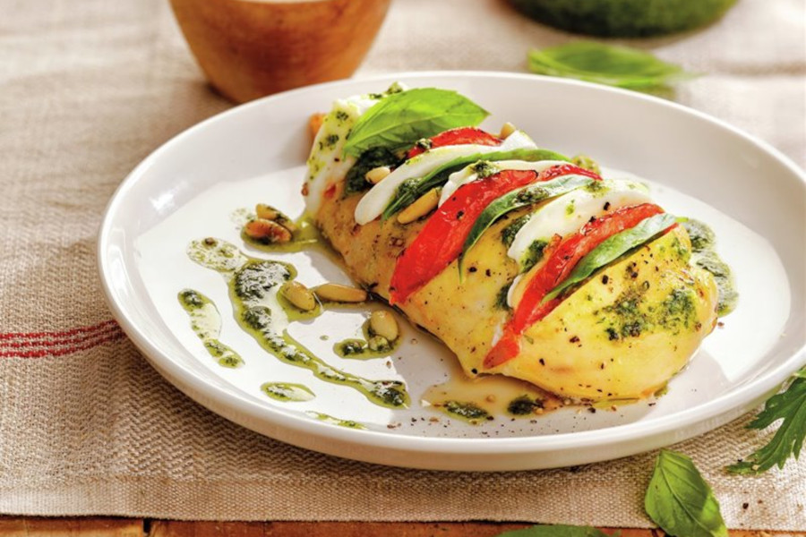

# Pollo Caprese Al Pesto

## Ingredientes

- 4 pechugas de pollo
- 2 bolas de mozzarella
- 2 tomates medianos
- 16 hojas de albahaca
- 250 ml de salsa pesto
- Piñones
- [Salsa pesto](salsa-pesto.md)
- Aceite de oliva
- Sal y pimienta

> Alternativa:
> Sustituye la mozzarella, el tomate y la albahaca por pimiento de piquillo, jamón serrano y queso azul.

## Preparación

Corta los tomates y las rodajas de mozzarella en rodajas de medio centímetro.

Haz cortes transversales a las pechugas, sin llegar hasta el fondo. En cada corte introduce una rodaja de tomate, otra de mozzarella y una hoja de albahaca.

Coloca las pechugas en una fuente de horno, salpiméntalas y pulveriza un poco de aceite sobre ellas. Introduce en el horno precalentado a 190 ºC y cocina 30 minutos.

Retira del horno y sirve con la salsa pesto y piñones tostados en una sartén sin aceite.
