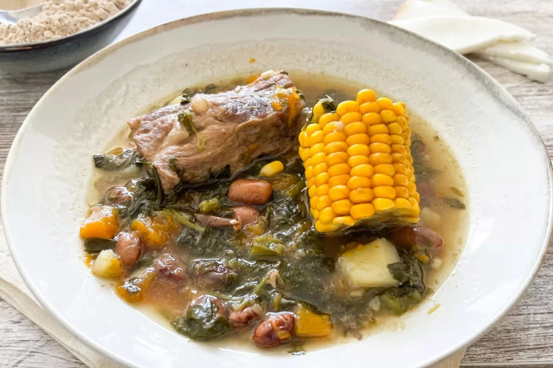

# Potaje de berros

## Ingredientes

- 500 g de berros
- 500 g de papas
- 600 g de costillas
- 1 cebolla grande
- 1 pimiento verde
- 3 piñas de millo
- 2 dientes de ajo
- Comino, azafrán, sal y pimienta

## Preparación

En una cazuela dorar las costillas junto al pimiento y la cebolla picada para que se pochen.

Una vez esté la cebolla transparente, añadir las papas cascadas y dejar rehogar unos minutos.

Añadir los berros, las piñas de millo junto con agua hasta cubrir y guisar durante 30 minutos.

Añadir las especias majadas y dejar guisar unos cinco minutos más.
