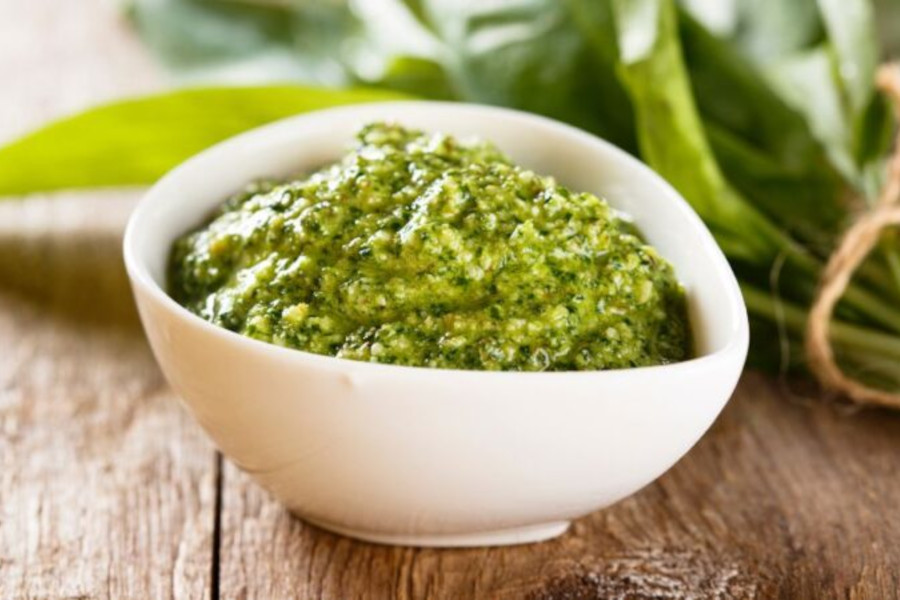

# Salsa Pesto

## Ingredientes

- 50 g de albahaca fresca
- 50 g de queso parmesano rallado
- 30 g de piñones tostados
- 150 ml de aceite de oliva
- 1 diente de ajo

## Preparación

En un vaso de batidora añade todos los ingredientes y tritura con la batidora hasta obtener una salsa fina.
