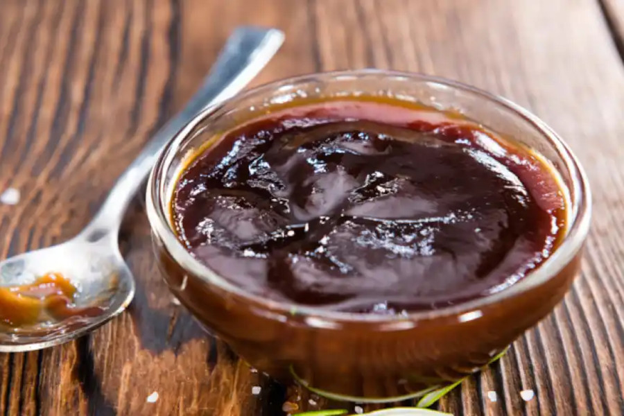

# Salsa Barbacoa

## Ingredientes

* 1 cebolla picada fina
* 250 ml de tomate triturado
* 2 cucharadas de azucar
* 2 cucharaditas de salsa Worcestershire
* 1 cucharadita de pimentón
* 1 cucharadita de mostaza antigua
* 2 cucharaditas de miel
* 1 cucharadita de salsa de soja
* 4 cucharaditas de vinagre
* 2 chorritos de tabasco
* 1 cucharadita de aceite de oliva
* pimienta negra y sal

## Preparación

Pocha la cebolla hasta quedar transparente, añade el azucar y sigue rehogando unos minutos para que la cebolla termine de caramelizarse por completo.

Añadir el tomate triturado y cocinar hasta que evapore la mayor parte del agua y coja un color más oscuro.

Añadir los demás condimentos y cocinar a fuego lento unos cinco minutos removiendo con frecuencia.

Rectificar con sal y pimienta, dejar reposar y servir.
