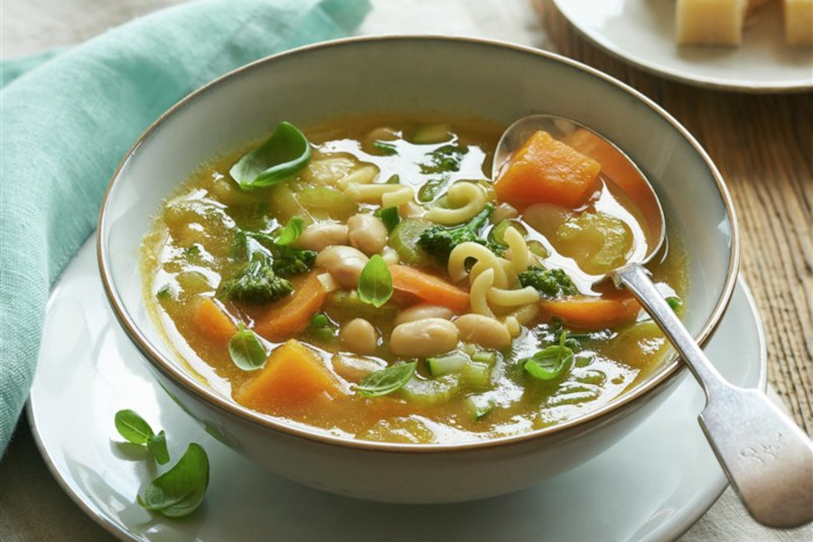

# Sopa Minestrone

## Ingredientes

- 80 g de alubias cocidas
- 100 g de pasta corta o arroz
- 1 tomate maduro
- 300 g de calabaza
- 3 pencas de apio
- 1 cebolla
- 1 zanahoria
- 1/2 calabacín
- 1/2 brócoli
- 2 litros de caldo de verdura
- 50 g de queso rallado
- Aceite de oliva
- 2 hojas de laurel
- Unas hojas de albahaca
- Sal y pimienta

## Preparación

Limpia la cebolla y pícala, pela el tomate y pícalo menudo, raspa la zanahoria y córtala en rodajas, pela y pica la calabaza, pica el calabacín, limpia el brócoli y córtalo en gajos y guisa las alubias.

En una cazuela con aceite sofríe la cebolla hasta que transparente, luego incorpora y tomate y rehoga 10 minutos para que evapore el agua. Vierte el caldo de verduras y añade el apio, la calabaza, el calabacín, la zanahoria y el laurel. Salpimenta y deja que cueza a fuego medio durante 15 minutos.

Agrega el brócoli, la pasta y las alubias y cuece hasta que la pasta esté lista según las indicaciones del fabricante. Añade la albahaca y rectifica salpimentando. Deja reposar la sopa.
