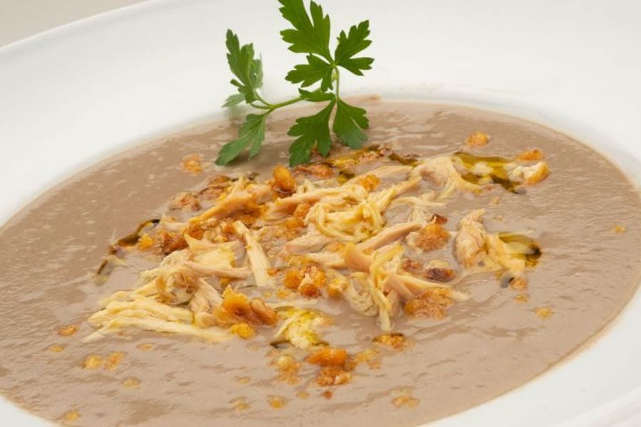

# Crema De Champinones

## Ingredientes

- 600 g de champiñones
- 1,5 l de caldo de verdura o pollo
- 1 muslo de pollo
- 2 cebollas
- 1 puerro
- 2 zanahorias
- 1 papa
- 70 g de maíz frito
- 2 dientes de ajo
- Aceite de oliva
- Perejil
- Sal y pimienta

## Preparación en robot de cocina

Limpiar y pelar las cebollas, el ajo, el puerro, las zanahorias y la papa. Introducirlos en el vaso del robot de cocina y picar durante 8 segundos a velocidad media.

Añadir aceite y sofreír la verdura durante 10 minutos.

Añadir el caldo, el muslo de pollo y los champiñones picados y cocinar durante 30 minutos a 95 ºC.

Una vez cocinado, retirar el muslo de pollo y triturar la crema durante 10 segundos a velocidad alta.

Retirar y desmenuzar la carne del muslo de pollo y añadirla a la crema junto al maíz frito. Probar el punto de sal, salpimentar si se considera necesario y dejar reposar al menos 30 minutos.

Servir con un chorrito de aceite de oliva y decorar con perejil.
