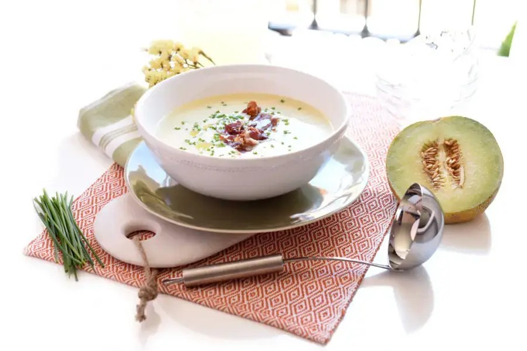

# Sopa De Melón

## Ingredientes

- 1,5 kg de melón
- 200 ml de nata líquida
- 1 yogur griego
- 1 limón
- Jamón serrano
- 1 ramito de menta fresca
- Aceite de oliva virgen extra
- Sal y pimienta

## Preparación

Corta el melón por la mitad, quita las semillas y extrae la pulpa colocándola en un bol grande que sea cómodo para usar con batidora.

Añade la nata líquida, el yogur, el zumo del limón y salpimenta.

Licúa la mezcla con una batidora y déjala enfriar en la nevera un par de horas con la ramita de menta fresca para aportar frescura.

Emplatar con un chorrito de aceite de oliva virgen extra y unas virutas de jamón serrano.
