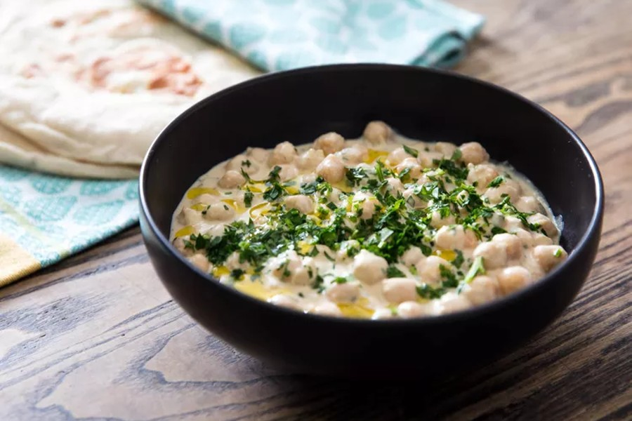

# Musabaha

## Ingredientes

- 300 g de garbanzos cocidos (200 gramos de garbanzos secos)
- 1 diente de ajo
- 1 pimienta
- 1 manojo de perejil fresco
- 1 limón
- Aceite de oliva virgen extra
- 3 cucharadas de tahini
- 1 cucharada de yogur griego
- Sal y pimienta

## Preparación

Pon en remojo los garbanzos desde el día anterior y cuécelos el tiempo indicado en el paquete. También puedes usar garbanzos congelados o de bote que se hacen mucho más rápidos.

Prepara una salsa verde con el perejil y la pimienta picadas fino, el ajo majado, unas cucharadas de aceite de oliva, sal y pimienta.

Prepara una salsa para los garbanzos mezclando el tahini, el yogur, el zumo de limón, sal y pimienta negra.

Reservar unos pocos garbanzos para la decoración final y poner el resto en un plato. Aplastar la mitad con un tenedor y picar grueso el resto, mezclar con la salsa de tahini y un par de cucharadas de la salsa de perejil.

Probar y ajustar de sal, pimienta y limón al gusto.

Añadir el resto de los garbanzos por encima, un chorrito de aceite de oliva y el resto de la salsa de hierbas.
